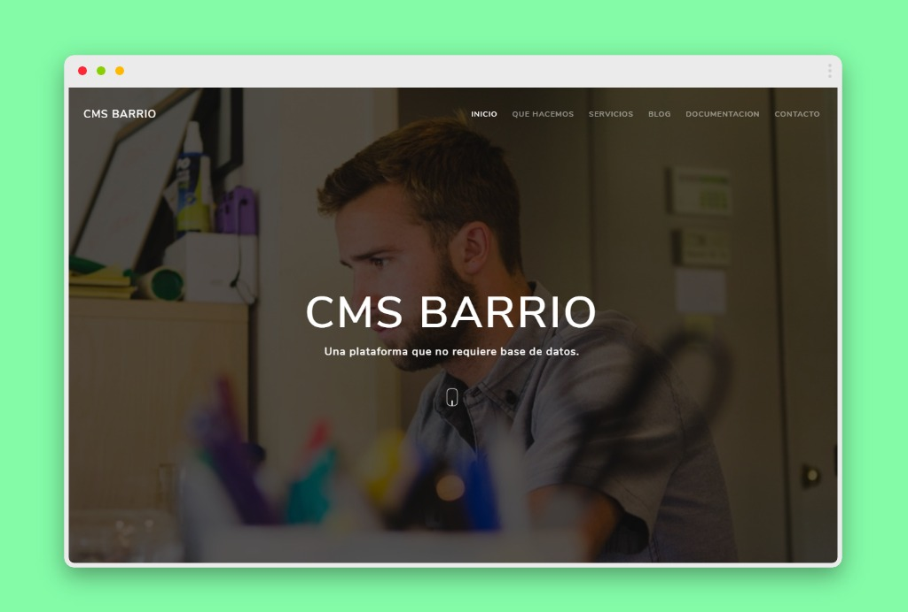

# ¿Que es CMS barrio

Como su nombre indica es un gestor de contenidos que no requiere base de datos sino que usa archivos estáticos ordenados por carpetas.

Incluye el editor para familiarizarse con los Shortcodes y con Markdown además de ejemplos dentro del editor.

## Instalación.

Copiaremos el contenido de la carpeta en nuestro Hosting y cambiaremos los datos del archivo config.php y ya solo queda crear y crear.

